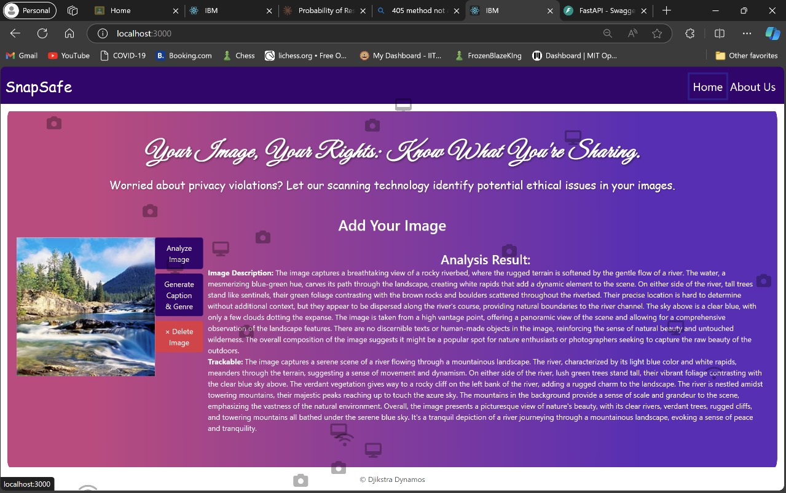

# PRISMATIC

**Privacy Recommendations with Integrated Social Media for Audio, Text, Images, and Captions**

## Project Overview

PRISMATIC is an AI-driven platform designed to ensure secure social media sharing by detecting and removing sensitive information while enhancing user engagement through personalized content suggestions. It integrates cutting-edge AI tools to provide a seamless and privacy-first experience for users.

## Problem Statement

In today's digital age, users frequently share multimedia content on social media, often unintentionally exposing sensitive information such as addresses, phone numbers, or financial details. This can lead to privacy breaches and misuse of personal data. Furthermore, users aim to make their posts engaging by adding music, catchy titles, or unique captions. 

PRISMATIC addresses this critical need by:
1. Detecting and redacting sensitive information.
2. Suggesting personalized captions, music, and titles.
3. Allowing secure sharing while enhancing post appeal.

## Features

### What Makes Us Unique?
 **Privacy First Approach:**
  - Identifies and redacts personal information in images and captions.
  - Provides user control to review and approve shared content.
  
 **Engaging Content Creation:**
  - Generates personalized captions tailored to the image's theme.
  - Recommends mood-based music tracks matching the content's vibe.

 **Comprehensive Security Features:**
  - Encrypts user data during uploads to ensure security.
  - Ensures compliance with industry privacy standards.

 **Seamless User Experience:**
  - User-friendly interface for easy uploads and real-time suggestions.
  - Instant feedback for edits and improvements.

 **Advanced AI Integration:**
  - Utilizes tools like **LlamaIndex** and **Ollama cpp** for content analysis.
  - Leverages dynamic learning to improve suggestions based on interactions.

  
  
  
  

## Advantages of PRISMATIC
 - **Comprehensive Privacy Protection:** Ensures secure sharing by redacting sensitive information across audio, text, images, and captions.
 - **Enhanced User Engagement:** Delivers personalized suggestions to make posts interactive and appealing.
 - **Seamless Integration:** Uses advanced tools like **FastAPI** and **Pydantic** for efficient data handling and content recommendations.

## Technologies Used
- **Backend:** FastAPI, Pydantic
- **AI Tools:** LlamaIndex, Ollama cpp
- **Security:** Advanced encryption standards
- **User Experience:** Intuitive design with real-time feedback

## License
This project is licensed under the GNU GENERAL PUBLIC LICENSE. 

